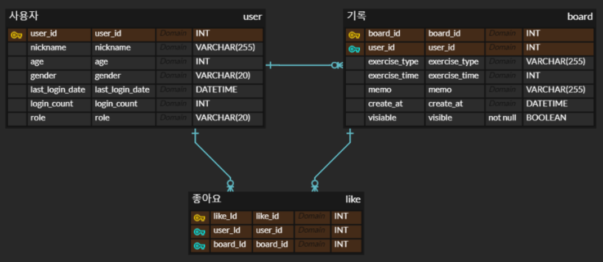

## 아이디어

⏬ 어떤 서비스를 제안하는지 기획 개요

<aside>
🍀 타켓 & 기획의도

📌 운동은 하고🏃🏻 싶지만 가서 할 생각을 하니 벌써 지쳐 매일 숨쉬기 운동 🛌🏻만 하는 운동인

사용자가 매일의 운동 기록을 작성하고 다른 사용자와 운동 기록을 공유하는 커뮤니티를 제공

좋아요 기능을 통해 운동 욕구에 자극을 받으면서 꾸준한 운동인이 될 수 있는 서비스 제공

</aside>

<aside>


## 💡프로그램
**Main 화면**

**User**

1. 사용자 등록
    - 입력 받을 내용
        - 닉네임
        - 나이
        - 성별
2. 로그인 (관리자 포함) / 로그아웃
3. 사용자 전체조회 (관리자만)
4. 연속 운동 날짜 기록 (서버 내부에서 자동으로)

**Board**

1. 전체 운동 기록 조회
    - 보여줄 항목
        - 게시글 번호
        - 게시자 닉네임
        - 운동 종류
        - 생성 일자
2. 개인 운동 기록 열람
    - 보여줄 항목
        - 게시글 번호
        - 사용자 닉네임
        - 운동 종류
        - 생성일자
3. 운동 기록 상세 조회
    - 보여줄 항목
        - 게시물 번호
        - 게시자 닉네임 - user join
        - 운동 종류
        - 운동 시간
        - 생성 일자
        - 기록 내용
        - 좋아요 수 - like join
        - 좋아요 여부 -
4. 운동 게시물 등록
    - 입력받을 내용
        - 운동 종류
        - 운동 시간
        - 기록 내용
5. 운동 게시물 삭제 → ‘visible’ 컬럼 기준으로 soft delete

   ⇒ 실제 데이터는 남겨 두기


**Like**

1. 게시물에 좋아요 표시 / 해제
</aside>


## 운동 기록 일기장
1. 테이블
    1. 사용자(user)
        1. 아이디
        2. 닉네임
        3. 나이
        4. 성별
        5. 접속날짜 (시간 되면)

       vii. 역할 (관리자와 사용자 구분)

    2. 게시물 (board)
        1. 운동 종류 입력
        2. 운동 시간
        3. 운동 내용
        4. 생성 날짜
        5. 좋아요 표시 가능
        6. 삭제 가능
            1. 게시물만 삭제
    3. 좋아요 (like_tb)
        1. 게시물에 좋아요 가능
            1. 게시물당 한번 가능

## ERD

[데브코스 1차 8팀 헬스보드](https://www.erdcloud.com/d/TamjfW9JDAN3Xanmn)




## SQL

```sql
use healthboard;

create database healthboard;
drop database healthboard;

DROP TABLE IF EXISTS `user`;

CREATE TABLE `user` (
    `user_id` INT NOT NULL AUTO_INCREMENT,
    `nickname` VARCHAR(255) NULL,
    `age` INT NULL,
    `gender` VARCHAR(20) NULL,
    `last_login_date` DATETIME NULL,
    `login_count` INT NULL,
    `role` VARCHAR(20) NULL,
    PRIMARY KEY (`user_id`)
);

-- 게시판 테이블 생성
DROP TABLE IF EXISTS `board`;

CREATE TABLE `board` (
    `board_id` INT NOT NULL AUTO_INCREMENT,
    `user_id` INT NOT NULL,
    `exercise_type` VARCHAR(255) NULL,
    `exercise_time` INT NULL,
    `memo` VARCHAR(255) NULL,
    `create_at` DATETIME NULL,
    `visible` BOOLEAN NULL,
    PRIMARY KEY (`board_id`),
    FOREIGN KEY (`user_id`) REFERENCES `user` (`user_id`)
);

-- 좋아요 테이블 생성
DROP TABLE IF EXISTS `like_tb`;

CREATE TABLE `like_tb` (
    `like_id` INT NOT NULL AUTO_INCREMENT,
    `user_id` INT NOT NULL,
    `board_id` INT NOT NULL,
    PRIMARY KEY (`like_id`),
    FOREIGN KEY (`user_id`) REFERENCES `user` (`user_id`),
    FOREIGN KEY (`board_id`) REFERENCES `board` (`board_id`)
);

-- 추가 제약 조건
ALTER TABLE `like_tb` ADD CONSTRAINT `FK_user_TO_like_tb_1` FOREIGN KEY (`user_id`) REFERENCES `user` (`user_id`);
ALTER TABLE `like_tb` ADD CONSTRAINT `FK_board_TO_like_tb_1` FOREIGN KEY (`board_id`) REFERENCES `board` (`board_id`)
```

### 더미 데이터

```sql
insert into user(nickname, age, gender, last_login_date, login_count, role)
values ('park', 26, '남자', '2024-08-01 18:03:10', 0, 'user'),
       ('kim', 30, '여자', curdate(), 8, 'user'),
       ('lee', 34, '남자', curdate(), 15, 'user');
       
insert into board(user_id, exercise_type, exercise_time, memo, create_at, visible)
values (1, 'running', 30, '가볍게 뛰었어요~', '2024-07-31 18:50:22', 1),
       (1, 'running', 40, '너무 힘들었어요~', '2024-08-01 18:20:10', 1),
       (2, 'weight', 60, '하체 했어요', '2024-08-05 12:40:30', 1);
       
insert into like_tb(user_id, board_id)
values (3, 1),
       (3, 2),
       (3, 3),
       (1, 2),
       (2, 1);
```

# Git convention

```
{tag}: {commit_message}
```

| 태그 | 설명 |
| --- | --- |
| feat | 새로운 기능 추가 |
| fix | 버그 수정 |
| refactor | 코드 리팩토링 |
| comment | 주석 추가(코드 변경 X) 혹은 오타 수정 |
| docs | README와 같은 문서 수정 |
| merge | merge |
| rename | 파일, 폴더명 수정 혹은 이동 |